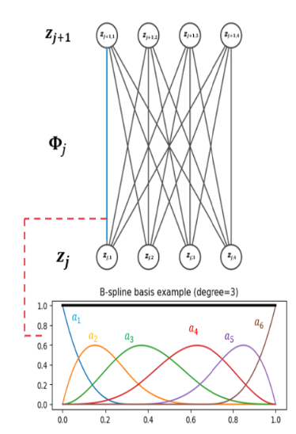

<!DOCTYPE html>
<html lang="en">
<head>
<meta charset="UTF-8">

</head>
<body>
    <h1>Welcome to My Webpage</h1>
    
Frankly  I'm not completely sure what this is supposed to be. This may just be a static, long snaking page of throughts and ideas, as well as the documentation of some of the math and projects that I have done in the past. 

<h2> Working with mathmode</h2>

</body>
<html lang="en">
<meta charset="UTF-8">
<body>
    <h1>Obsession</h1>
    
I saw the movie obsession the other day at the Kenworthy theater. I think one thing that was a bit scary about it was the misconception. We see in the movie that before the wish, Nikki is leaving Bear's car to go inside. After the wish, she comes out of the house completely changed, and finding ways to get Bear to either come inside or stay the night at his house. She is completely transfixed by him, but we see small cracks where the "true Nikki" appears to resurface. There was the moment when her and bear were on the bed the first night she stayed over, and said "wait what the fuck?", the moment when Bear was on the phone with the Wishing Willow company and hearing the screaming voice of Nikki over the phone, and lastly the moment where the real Nikki came out the night to ask bear to kill her. For the last moment, she claimed the "other one was asleep". This convinced many (including me) that there was some kind of possesion. That there was some "non Nikki" that was inhabiting her body. But after the movie there was some googling (as there always is), and it turns out the director made a statement that it was the "real Nikki" that was obsessed.

I think this makes it a bit better. For possession, there is this idea that you are not in control of your body, and there is another entity, that has taken it from the true you. However, if it is truly Nikki making the decisions, it means that there is a corruption of the true self. That is it the real Nikki who has become a shell of her former self, with all of her aspirations and charm and wit. To have her true self to be twisted in this way is much more horrifying, as she loses all automonomy.

 I throught it was so funny how long Bear was completely in denial of anything wrong in the relationship in front of his friends. Every single time people were saying that it was kind of weird that Nikki and him were together and that he may be going through a psychotic break, but he was too preoccupied with the idea of them being together being paletable to admit anything and ask for help. "How bad could it be just to be with me?" he asked the real Nikki. It felt like he was trying to convince people that it could happen, as a sign of status as a man. If he just swallowed his pride, he may have gotten Ian (rest in peace) or someone else not to wish for 1 billion dollars and solve the problem.

Now it is time for $\sqrt{36}\sqrt{49}$
